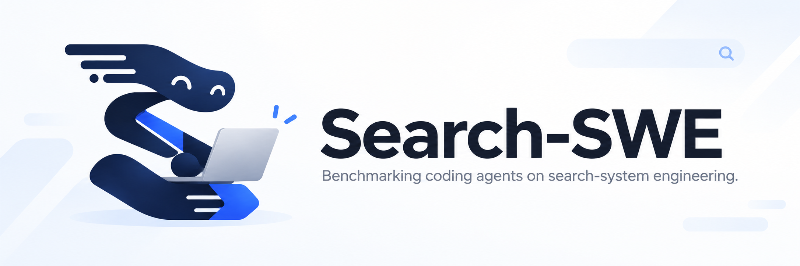

<p align="center">
  
</p>

<h1 align="center">
  Search-SWE
  <br>
  <sub>🔍 面向搜索系统工程的编码智能体评测基准。 🤖</sub>
</h1>

<p align="center">
  <a href="https://search-swe.github.io/"></a>
  <a href="https://search-swe.github.io/tasks.html"></a>
  <a href="https://huggingface.co/datasets/search-swe/Search-SWE"></a>
  <a href="LICENSE"></a>
</p>

<p align="center">
  <a href="README.md">English</a> · <b>简体中文</b>
</p>

> *Note: Search-SWE 是一个持续演进的项目，任务、文档和评测结果仍在不断更新。*

## 📖 概述

Search-SWE 评估编码智能体能否在固定资源约束下**实现和优化**真实的搜索系统。
智能体需要检查环境、编写并运行代码、测试系统，最终提交可执行的实现。评测关注
系统的实际表现，包括检索质量、功能正确性和资源消耗。

| 模式 | 智能体目标 | 示例问题 |
| --- | --- | --- |
| 实现 | 根据任务说明构建可运行的搜索能力。 | 推理辅助检索、内存受限的向量搜索。 |
| 优化 | 在固定约束下提升搜索质量或效率。 | 长文档重排序、嵌入模型微调、查询编码器优化。 |

每个任务都明确规定输入、提交接口、评测标准和资源预算。评测方式、仓库结构和
固定数据与模型的来源见[基准设计](docs/benchmark.md)。

## 🚀 快速开始

下面的示例在 CPU 上使用 Pi 编码智能体和 DeepSeek Flash 跑通 `task-1-1`。
Search-SWE 需要 Python 3.12 或更新版本，以及满足所选任务 CPU、内存、存储和
可选 GPU 要求的 Docker。

### 1. 安装宿主机工具

```bash
git clone https://github.com/VectorSpaceLab/Search-SWE.git
cd Search-SWE
python -m pip install -r scripts/requirements.txt
```

`scripts/requirements.txt` 提供固定版本的 Harbor 启动器和 Hugging Face 资源
客户端。在任意已有的 Python 3.12+ 环境中运行即可；如果尚未使用隔离环境，建议
使用 venv 或 Conda，但不强制指定环境管理工具。任务专属的 Python 依赖安装在
Docker 镜像内。

### 2. 恢复任务资源

```bash
python scripts/download_assets.py --task task-1-1
python scripts/download_assets.py --task task-1-1 --verify-only
```

下载器会核对文件大小和 SHA-256，并复用已通过校验的文件。

### 3. 配置智能体与验证器

仓库跟踪的模板已经列出所有支持的凭证，并注明每个变量何时需要。复制一次即可；
真实密钥只填写到被 Git 忽略的 `.env` 中：

```bash
cp .env.example .env
chmod 600 .env
```

本例使用 Pi + DeepSeek，只需在 `.env` 中填写下面四项，其余暂时留空：

```dotenv
AGENT_MODEL=deepseek/deepseek-flash
DEEPSEEK_API_KEY=YOUR_DEEPSEEK_KEY
VERIFIER_OPENAI_BASE_URL=https://api.deepseek.com/
VERIFIER_OPENAI_API_KEY=YOUR_DEEPSEEK_KEY
```

`DEEPSEEK_API_KEY` 用于 `deepseek/deepseek-flash` 的 Pi 智能体认证；`VERIFIER_*`
通过 RewardKit 0.2.0 运行固定为 `deepseek-flash` 的独立轨迹评审，除 `task-2-4`
外的所有任务都需要。同一个 DeepSeek key 可以填入两个变量，但启动器只把 verifier
副本传进 verifier 容器。

其他运行方式只需填写 `.env` 中对应的分组：

- Pi + GLM-5.3-Flash：设置 `AGENT_MODEL=zai/glm-5.3-flash` 和 `ZAI_API_KEY`。
- Codex：设置 `AGENT_MODEL`、`AGENT_OPENAI_BASE_URL` 和
  `AGENT_OPENAI_API_KEY`。
- Claude Code：设置 `AGENT_MODEL` 和 `AGENT_ANTHROPIC_API_KEY`；共享启动器
  只使用 Anthropic 官方 API。
- Task 1-3：还必须填写三个 `ANSWER_JUDGE_*` 变量。
- 可选 submission API：只在 `.env.example` 注释所列任务确实使用时，填写
  `TASK_1_1_OPENROUTER_API_KEY`、`OPENROUTER_API_KEY` 或 `JINA_API_KEY`。

凭证隔离、自定义服务地址、网络权限和完整的逐任务配置矩阵见
[评测指南](docs/evaluation.md)。

### 4. 使用 Pi 和 DeepSeek Flash 运行

```bash
bash scripts/run_task.sh --task task-1-1 --agent pi \
  --thinking xhigh --dry-run

bash scripts/run_task.sh --task task-1-1 --agent pi \
  --thinking xhigh \
  --output jobs/task-1-1-pi-deepseek
```

dry-run 只打印 Harbor 命令、不启动容器。第二条命令会构建任务镜像、运行智能体
和独立验证器，并把 reward 与任务记录写入 `jobs/task-1-1-pi-deepseek`。

<details>
<summary><strong>其他智能体示例</strong></summary>

以下示例复用已下载的任务资源和上面的 `VERIFIER_*` 配置。只需配置所选编码
智能体对应的凭证组。

#### Pi 和 Z.AI GLM-5.3-Flash

在 `.env` 中修改智能体模型并填写对应密钥。RewardKit judge 不会随之改变，因此
仍需保留 `VERIFIER_*` DeepSeek 配置：

```dotenv
AGENT_MODEL=zai/glm-5.3-flash
ZAI_API_KEY=YOUR_ZAI_KEY
```

```bash
bash scripts/run_task.sh --task task-1-1 --agent pi \
  --thinking xhigh \
  --output jobs/task-1-1-pi-glm
```

#### Codex 和 GPT 模型

配置你的 GPT 兼容服务所接受的模型名称和凭证：

```dotenv
AGENT_MODEL=YOUR_GPT_MODEL
AGENT_OPENAI_BASE_URL=https://your-agent-endpoint.example/v1
AGENT_OPENAI_API_KEY=YOUR_AGENT_KEY
```

```bash
bash scripts/run_task.sh --task task-1-1 --agent codex \
  --reasoning-effort xhigh --output jobs/task-1-1-codex
```

如果所选模型或服务不支持推理强度，请省略 `--reasoning-effort`。

#### Claude Code 和 Anthropic 官方 API

所有任务镜像都预装 Claude Code 2.1.273。填写 API 账户可用的 Anthropic 模型
和独立的编码智能体密钥：

```dotenv
AGENT_MODEL=claude-sonnet-4-6
AGENT_ANTHROPIC_API_KEY=YOUR_ANTHROPIC_KEY
```

```bash
bash scripts/run_task.sh --task task-1-1 --agent claude-code \
  --reasoning-effort high --output jobs/task-1-1-claude
```

共享启动器只支持通过 API key 访问 `api.anthropic.com`；首版有意不支持自定义
gateway、订阅 OAuth、Bedrock、Vertex、ACP 和自定义 Claude settings。默认 Codex
流程见[快速开始指南](docs/quickstart.md)；各任务的凭证与硬件矩阵，以及 GPU、
网络权限和自定义模型服务配置见[评测指南](docs/evaluation.md)。

</details>

## 📚 文档索引

| 文档 | 内容 |
| --- | --- |
| [快速开始指南](docs/quickstart.md) | 完整的一次 CPU 评测流程 |
| [评测指南](docs/evaluation.md) | 各任务凭证、编码智能体、GPU、网络策略和自定义模型服务 |
| [网络权限](docs/network-policy.md) | Harbor 网络模式与各任务精确的 host allowlist |
| [资源说明](docs/assets.md) | 固定数据与模型的下载、校验和恢复 |
| [基准设计](docs/benchmark.md) | 评测方式、仓库结构和数据来源 |

任务介绍和评测结果可在[项目主页](https://search-swe.github.io/)查看，主页由
[独立仓库](https://github.com/search-swe/search-swe.github.io)维护。

## 🤝 参与贡献

欢迎贡献任务包、共享镜像、启动器、测试和文档。请保持每次修改范围清晰，并提供
实际执行过的各层验证证据。

创建新任务或大幅修改已有任务时，请先阅读仓库内的
[贡献者工作流](.agents/AGENTS.md)和
[`create-searchswe-task` skill](.agents/skills/create-searchswe-task/SKILL.md)。
`.agents/` 目录包含面向智能体辅助贡献的 skills、参考资料和工具。兼容的智能体
框架可以直接调用 `$create-searchswe-task`；其他环境也可以直接阅读该 skill 文件。
其中覆盖任务设计、CPU/GPU 脚手架、固定输入、verifier 隔离和分阶段验证。

请复用 [`docker/README.md`](docker/README.md) 中说明的共享镜像，不要提交 API
密钥、下载得到的任务输入、隐藏 verifier 数据或 job 输出。修改共享用户文档时，
应保持 `README.md` 和 `README_zh.md` 一致。

提交 pull request 前，至少运行仓库级检查：

```bash
python scripts/check_release.py
python -m unittest discover -s scripts/tests -p 'test_*.py'
git diff --check
```

任务修改还需要完成 skill 的
[验证指南](.agents/skills/create-searchswe-task/references/validation.md)中对应的
任务专项和运行时检查。若修改了 skill 或脚手架，请运行：

```bash
python .agents/skills/create-searchswe-task/scripts/test_scaffold_task.py
```

请在 pull request 中概述修改范围，列出执行过的命令和结果，并明确说明因外部数据、
GPU、凭证或付费 API 而未执行的检查。

## 引用

TBA
